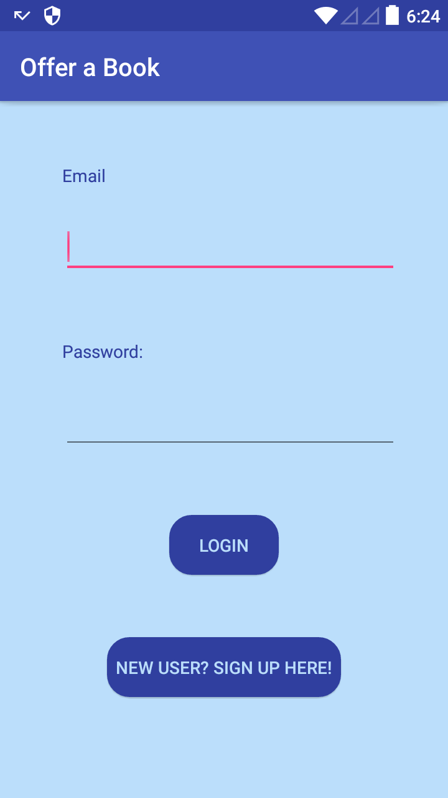
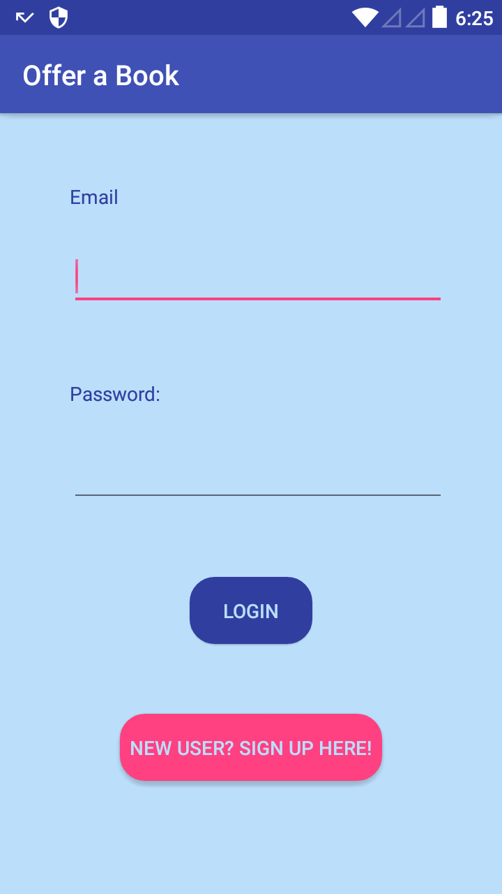
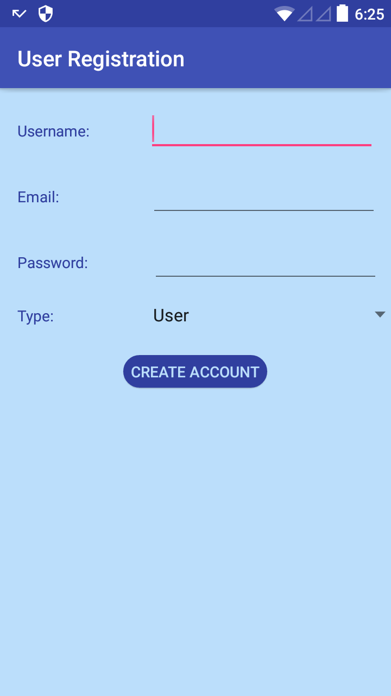
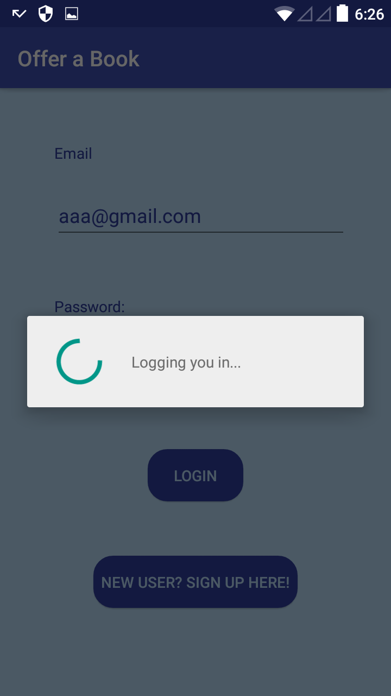
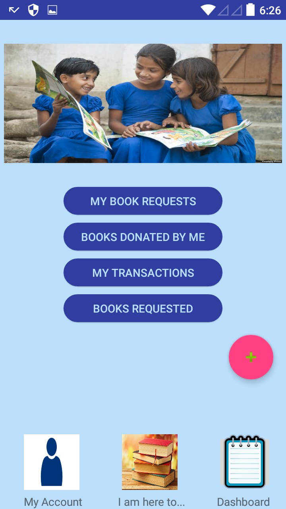
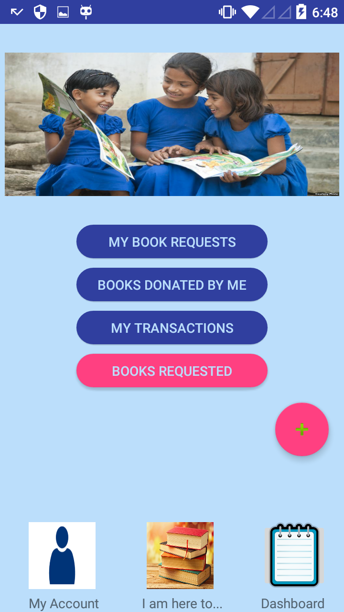
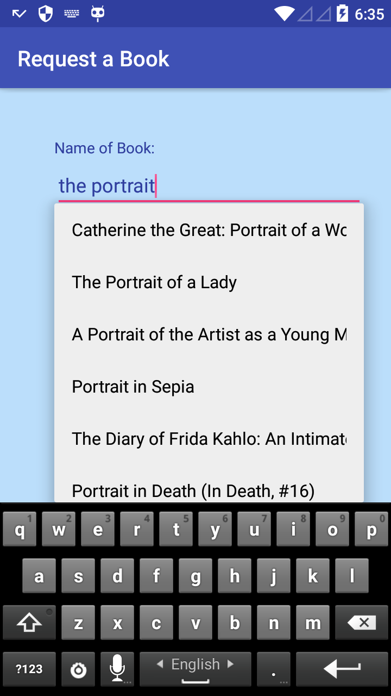
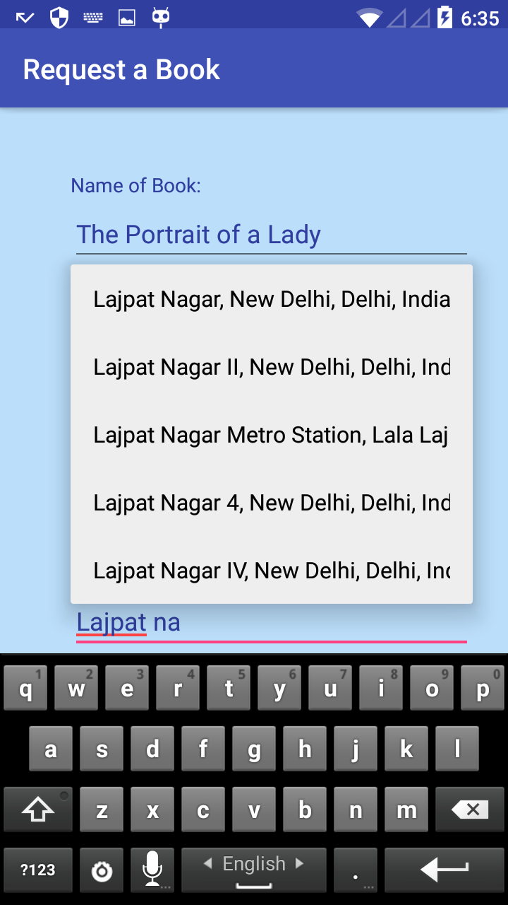
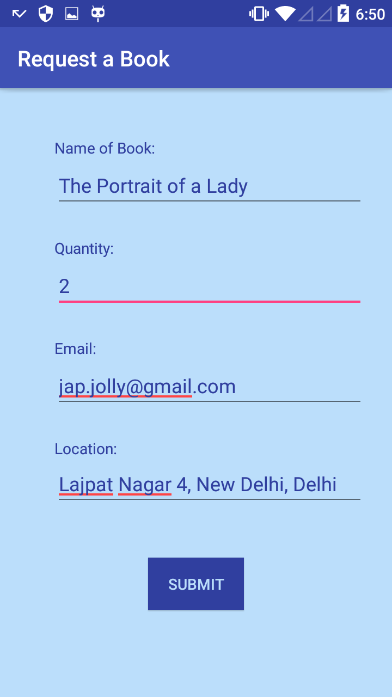

# Android-app

This repository contains the code for the Android app: **Offer a Book**.

This app would serve as an avenue for philanthropists /donors, who want to spread the light of education by gifting money for books that are needed by the underprivileged schools and also provide an opportunity to the senior students, who might like to gift their pre-owned/used books to the junior students from the poor section of the society. The very same pre-used books may help uplift the lives of many eager but poor students, who may not have the resources to buy such expensive books.

Here are a few screenshots of the app:

The login page, which has a link for new user registrations, which when clicked redirects to the signup page:

 

After the user is logged in, his/her Dashboard opens up. Upon clicking on the respective button, the page is redirected.

On clicking the floating button, the two main options for the two main features of the app open up, i.e., to **Donate a Book** or to **Request a Book**

Goodreads API has been integrated to autocomplete book search and fetch the response. 

Google Places API has been integrated in the app to auto fetch location.

The book is requested successfully on submitting.

I am still working on the application to add more features.

The code for the Backend Api nodeJS Server can be found at this link: https://github.com/Jap-Leen/Backend-server
